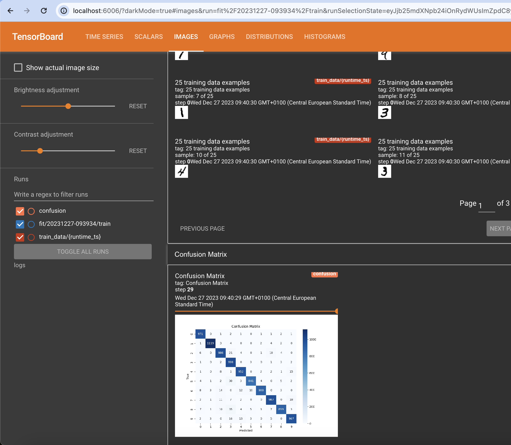
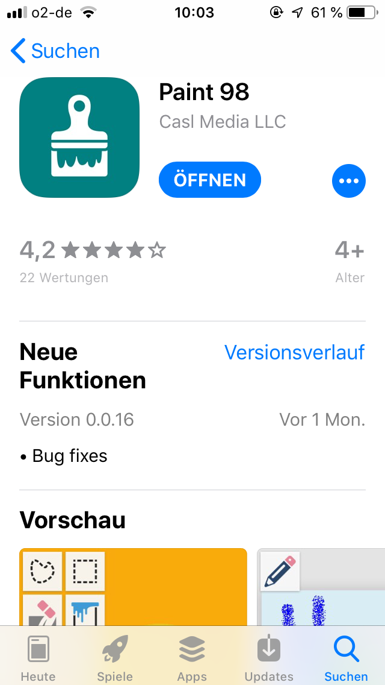
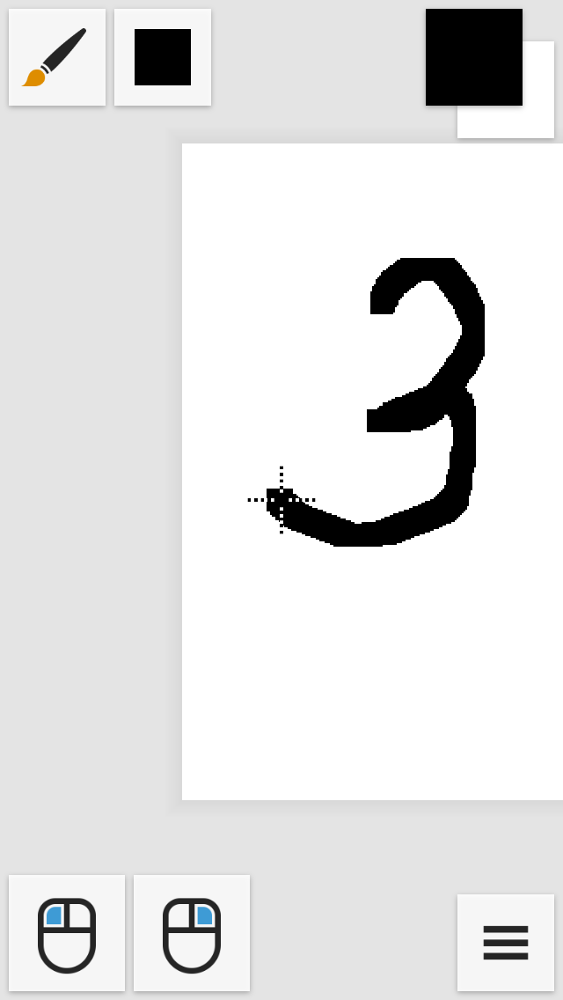
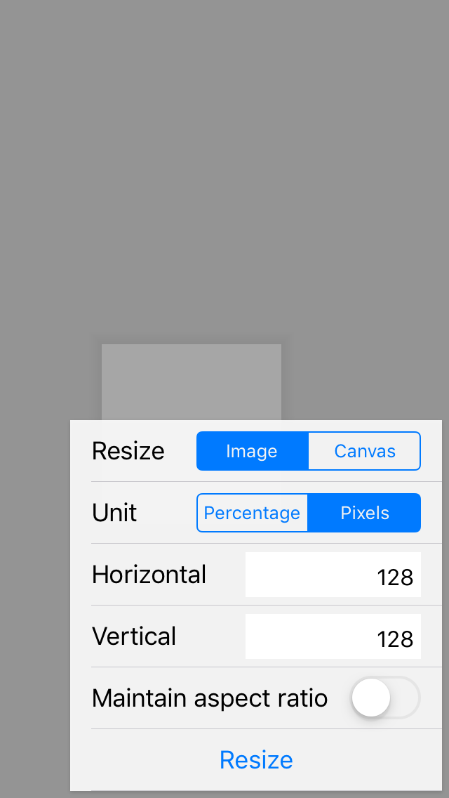
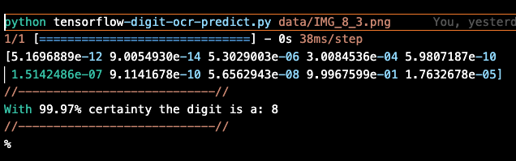

# learning-machine-learning
various machine learning exercises

# Create a virtual environment
python -m venv .venv \
pip install -r requirements.txt

# Training network for digit ocr
Run training with mnist data: \
tensorflow-mnist-digit-ocr.py

# Network diagnostics using tensorboard
run: tensorboard --logdir logs/fit

  

# Test with own image
Create a test image using the iOS App Paint 98 as shown below.\
The generated 28 x 28 picture can then be classified with tensorflow-digit-ocr-predict.py path_to_image

  
  
  
  

Output should look as follows:\

  

